# 🧠 محرك التفكير المتطور للوكيل الهجومي الذكي - التكامل والتحسين

## 📊 نظرة عامة على التكامل

بناءً على الهيكل المعماري المتميز الذي قدمته، سأقوم بدمج محرك التفكير المتطور مع نظامنا الحالي، مع التركيز على التعامل مع تقنيات الأمان الناشئة وتحسين آلية التعلم المستمر.

```mermaid
graph TB
    A[محرك التفكير المتطور] --> B[النواة الأساسية BDI-HTN]
    A --> C[نظام إدارة الوكلاء المتخصصين]
    A --> D[آلية حل التعارضات]
    A --> E[مصفوفة القرار المتقدمة]
    
    B --> F[نظام مكافحة الهلوسة]
    B --> G[نظام الحفاظ على الذاكرة]
    B --> H[مستويات الثقة المتعددة]
    
    C --> I[وكلاء الاستطلاع والتحليل]
    C --> J[وكلاء الاستغلال والتثبيت]
    C --> K[وكلاء التكيف مع التقنيات الناشئة]
    
    D --> L[نظرية بايز للتحديث]
    D --> M[نظرية دمستر-شافر للتعامل مع عدم اليقين]
    D --> N[كشف وحل التعارضات]
    
    E --> O[عملية AHP متعددة المعايير]
    E --> P[فحص الاتساق والتحليل الحساسية]
    E --> Q[معايير اختراق الاختراق المتخصصة]
    
    A --> R[التكامل مع النظام الرئيسي]
    R --> S[نظام الإضافات الذكية]
    R --> T[منصة التعلم المستمر]
    R --> U[الواجهة التفاعلية]
```



## 🎯 التكامل التنفيذي لمحرك التفكير المتطور

### 1. النواة الأساسية المعززة (`enhanced_core.py`)

```python
class EnhancedBDIHTNCore:
    def __init__(self, plugin_system, learning_system):
        self.beliefs = self.initialize_beliefs()
        self.desires = self.initialize_desires()
        self.intentions = self.initialize_intentions()
        self.plugin_system = plugin_system
        self.learning_system = learning_system
        self.hallucination_prevention = HallucinationPreventionSystem()
        self.memory_preservation = MemoryPreservationSystem()
        
    def initialize_with_plugins(self):
        """تهيئة المحرك مع دعم الإضافات المتخصصة"""
        # تحميل إضافات المعرفة والتفكير
        knowledge_plugins = self.plugin_system.get_plugins_by_category('knowledge_enhancement')
        for plugin in knowledge_plugins:
            self.integrate_knowledge_plugin(plugin)
            
        # تحميل إضافات التفكير والاستدلال
        reasoning_plugins = self.plugin_system.get_plugins_by_category('reasoning_enhancement')
        for plugin in reasoning_plugins:
            self.integrate_reasoning_plugin(plugin)
    
    def integrate_knowledge_plugin(self, plugin):
        """دمج إضافة معرفية في نظام المعتقدات"""
        plugin_knowledge = plugin.extract_knowledge()
        for belief, confidence in plugin_knowledge.items():
            self.update_belief(belief, confidence, source=f"plugin_{plugin.id}")
    
    def update_belief(self, belief, confidence, source=None):
        """تحديث المعتقد مع التحقق من الهلوسة"""
        # التحقق من الهلوسة قبل التحديث
        if not self.hallucination_prevention.validate_belief(belief, confidence, source):
            self.learning_system.record_hallucination_attempt(belief, source)
            return False
            
        # تحديث المعتقد مع الحفاظ على الذاكرة
        success = self.memory_preservation.update_belief_safely(
            self.beliefs, belief, confidence, source
        )
        
        if success:
            self.learning_system.record_belief_update(belief, confidence, source)
        
        return success
    
    def execute_reasoning_cycle(self, context):
        """تنفيذ دورة تفكير متكاملة مع التعلم المستمر"""
        # جمع المعطيات من السياق
        observations = self.observe_environment(context)
        
        # تحديث المعتقدات بناءً على الملاحظات
        for observation, confidence in observations.items():
            self.update_belief(observation, confidence, source="environment_observation")
        
        # توليد الرغبات بناءً على المعتقدات المحدثة
        new_desires = self.generate_desires()
        
        # اختيار النوايا بناءً على الرغبات والمعلومات
        selected_intentions = self.select_intentions(new_desires)
        
        # تخطيط HTN للمهمة
        plan = self.htn_planning(selected_intentions, context)
        
        # تنفيذ الخطة مع المراقبة
        results = self.execute_plan(plan, context)
        
        # التعلم من النتائج
        self.learn_from_execution(results, context)
        
        return results
```

### 2. نظام مكافحة الهلوسة المعزز (`advanced_hallucination_prevention.py`)

```python
class AdvancedHallucinationPreventionSystem:
    def __init__(self, knowledge_base, plugin_system):
        self.knowledge_base = knowledge_base
        self.plugin_system = plugin_system
        self.cross_validation = CrossValidationSystem()
        self.confidence_thresholds = self.initialize_confidence_thresholds()
        
    def validate_belief(self, belief, confidence, source):
        """التحقق من صحة المعتقد باستخدام تقنيات متعددة"""
        validation_methods = [
            self.validate_against_knowledge_base,
            self.validate_with_plugins,
            self.cross_validate_with_external_sources,
            self.check_logical_consistency,
            self.assess_source_reliability
        ]
        
        validation_results = []
        for method in validation_methods:
            result = method(belief, confidence, source)
            validation_results.append(result)
            
            # إذا فشل التحقق في مرحلة مبكرة، نوقف فوراً
            if not result['valid'] and result['critical']:
                return False
        
        # اتخاذ قرار بناءً على جميع نتائج التحقق
        return self.make_validation_decision(validation_results)
    
    def validate_with_plugins(self, belief, confidence, source):
        """التحقق من المعتقد باستخدام الإضافات المتخصصة"""
        validation_plugins = self.plugin_system.get_plugins_by_category('validation')
        plugin_results = []
        
        for plugin in validation_plugins:
            if plugin.supports_validation_type(belief.type):
                result = plugin.validate_belief(belief, confidence, source)
                plugin_results.append({
                    'plugin_id': plugin.id,
                    'result': result,
                    'confidence': plugin.get_confidence_level()
                })
        
        return self.aggregate_plugin_validation_results(plugin_results)
    
    def assess_source_reliability(self, source):
        """تقييم موثوقية المصدر باستخدام التعلم الآلي"""
        if not source:
            return {'reliability': 0.5, 'historical_accuracy': 0.5}
            
        # استخدام التعلم العميق لتقييم مصداقية المصدر
        reliability_model = self.load_reliability_model()
        source_features = self.extract_source_features(source)
        
        reliability_score = reliability_model.predict(source_features)
        
        # تحديث نموذج الموثوقية بناءً على الأداء التاريخي
        historical_accuracy = self.calculate_historical_accuracy(source)
        
        return {
            'reliability': reliability_score,
            'historical_accuracy': historical_accuracy
        }
```

### 3. نظام التعلم المستمر المعزز (`enhanced_continuous_learning.py`)

```python
class EnhancedContinuousLearningSystem:
    def __init__(self, memory_system, plugin_system):
        self.memory_system = memory_system
        self.plugin_system = plugin_system
        self.success_patterns = SuccessPatternDatabase()
        self.failure_patterns = FailurePatternDatabase()
        self.adaptation_engine = AdaptationEngine()
        
    def learn_from_experience(self, task, result, context):
        """التعلم من التجربة مع دعم الإضافات"""
        learning_data = self.analyze_experience(task, result, context)
        
        if result['success']:
            self.extract_success_patterns(learning_data)
        else:
            self.extract_failure_lessons(learning_data)
        
        # تحديث الإضافات المتخصصة بناءً على التعلم
        self.update_specialized_plugins(learning_data)
        
        # تطوير استراتيجيات جديدة للتكيف مع التقنيات الناشئة
        new_strategies = self.develop_adaptation_strategies(learning_data)
        
        return new_strategies
    
    def extract_failure_lessons(self, learning_data):
        """استخلاص الدروس من الفشل وتحويلها إلى معرفة قابلة للتنفيذ"""
        failure_analysis = self.analyze_failure_root_causes(learning_data)
        
        # تحديد فجوات المعرفة والمهارات
        knowledge_gaps = self.identify_knowledge_gaps(failure_analysis)
        skill_gaps = self.identify_skill_gaps(failure_analysis)
        
        # تطوير خطط لسد الفجوات
        self.develop_gap_closing_plans(knowledge_gaps, skill_gaps)
        
        # تحويل الدروس إلى إضافات متخصصة
        self.create_specialized_plugins_from_lessons(failure_analysis)
        
        # تحديث نماذج التنبؤ بالفشل
        self.update_failure_prediction_models(failure_analysis)
    
    def create_specialized_plugins_from_lessons(self, failure_analysis):
        """تطوير إضافات متخصصة من دروس الفشل"""
        for lesson in failure_analysis['valuable_lessons']:
            plugin_requirements = self.translate_lesson_to_plugin_requirements(lesson)
            
            # استخدام وكيل تطوير الإضافات لإنشاء الإضافة
            plugin_developer = self.plugin_system.get_plugin_developer()
            new_plugin = plugin_developer.develop_plugin(
                plugin_requirements, 
                context=failure_analysis['context']
            )
            
            # دمج الإضافة الجديدة مع النظام
            if self.validate_plugin(new_plugin):
                self.plugin_system.integrate_plugin(new_plugin)
                self.learning_system.record_plugin_creation(lesson, new_plugin)
```

### 4. نظام الوكلاء المتخصصين المعزز (`enhanced_specialized_agents.py`)

```python
class EnhancedSpecializedAgentsSystem:
    def __init__(self, core_engine, plugin_system):
        self.core_engine = core_engine
        self.plugin_system = plugin_system
        self.agents = self.initialize_specialized_agents()
        self.coordination_mechanism = AdvancedCoordinationMechanism()
        self.learning_integration = LearningIntegrationSystem()
        
    def initialize_specialized_agents(self):
        """تهيئة الوكلاء المتخصصين مع دعم الإضافات"""
        agent_types = [
            'reconnaissance', 'vulnerability_analysis', 'exploitation',
            'post_exploitation', 'defense_evasion', 'emerging_tech_adaptation'
        ]
        
        agents = {}
        for agent_type in agent_types:
            agents[agent_type] = self.create_agent(agent_type)
            
            # تحميل الإضافات المتخصصة لكل وكيل
            agent_plugins = self.plugin_system.get_plugins_for_agent(agent_type)
            for plugin in agent_plugins:
                agents[agent_type].integrate_plugin(plugin)
        
        return agents
    
    def create_agent(self, agent_type):
        """إنشاء وكيل متخصص مع القدرات المناسبة"""
        agent_capabilities = self.define_agent_capabilities(agent_type)
        agent_learning_profile = self.create_learning_profile(agent_type)
        
        return SpecializedAgent(
            agent_type=agent_type,
            capabilities=agent_capabilities,
            learning_profile=agent_learning_profile,
            communication_interface=self.create_communication_interface(agent_type)
        )
    
    def coordinate_agents(self, complex_task, context):
        """تنسيق عمل الوكلاء المتخصصين لمهمة معقدة"""
        # تحليل المهمة وتحديد الوكلاء المطلوبين
        required_agents = self.identify_required_agents(complex_task, context)
        
        # توزيع المهام على الوكلاء
        task_allocations = self.allocate_tasks_to_agents(complex_task, required_agents)
        
        # إنشاء خطة تنسيق بين الوكلاء
        coordination_plan = self.coordination_mechanism.create_coordination_plan(
            task_allocations, context
        )
        
        # تنفيذ المهمة مع التنسيق
        results = self.execute_coordinated_plan(coordination_plan, context)
        
        # التعلم من التنسيق والنتائج
        self.learn_from_coordination_experience(coordination_plan, results, context)
        
        return results
    
    def learn_from_coordination_experience(self, coordination_plan, results, context):
        """التعلم من تجارب التنسيق بين الوكلاء"""
        coordination_analysis = self.analyze_coordination_performance(
            coordination_plan, results, context
        )
        
        # تحديد مجالات التحسين في التنسيق
        improvement_areas = self.identify_coordination_improvements(coordination_analysis)
        
        # تطوير استراتيجيات تنسيق أفضل
        new_coordination_strategies = self.develop_improved_coordination_strategies(
            improvement_areas
        )
        
        # تحديث آلية التنسيق
        self.coordination_mechanism.update_strategies(new_coordination_strategies)
        
        # تطوير إضافات لتحسين التنسيق
        self.create_coordination_enhancement_plugins(improvement_areas)
```

### 5. نظام التكيف مع التقنيات الناشئة (`emerging_tech_adaptation.py`)

```python
class EmergingTechnologyAdaptationSystem:
    def __init__(self, knowledge_base, plugin_system, learning_system):
        self.knowledge_base = knowledge_base
        self.plugin_system = plugin_system
        self.learning_system = learning_system
        self.tech_monitor = TechnologyMonitoringAgent()
        self.adaptation_developer = AdaptationDevelopmentAgent()
        
    def monitor_emerging_technologies(self):
        """مراقبة التقنيات الناشئة وتحديات الأمان الجديدة"""
        emerging_tech = self.tech_monitor.detect_emerging_technologies()
        
        for technology in emerging_tech:
            # تحليل تأثير التقنية على الأمان
            impact_analysis = self.analyze_security_impact(technology)
            
            # تطوير استراتيجيات التكيف
            adaptation_strategies = self.develop_adaptation_strategies(technology, impact_analysis)
            
            # إنشاء إضافات متخصصة للتكيف
            self.create_adaptation_plugins(technology, adaptation_strategies)
            
            # تحديث قاعدة المعرفة
            self.update_knowledge_base(technology, impact_analysis, adaptation_strategies)
    
    def develop_adaptation_strategies(self, technology, impact_analysis):
        """تطوير استراتيجيات للتكيف مع التقنيات الناشئة"""
        strategies = []
        
        # استراتيجيات هجومية للتكيف مع التقنيات الجديدة
        offensive_strategies = self.develop_offensive_adaptations(technology, impact_analysis)
        strategies.extend(offensive_strategies)
        
        # استراتيجيات دفاعية لحماية النظام نفسه
        defensive_strategies = self.develop_defensive_adaptations(technology, impact_analysis)
        strategies.extend(defensive_strategies)
        
        # استراتيجيات تعلم للتكيف المستمر
        learning_strategies = self.develop_learning_adaptations(technology, impact_analysis)
        strategies.extend(learning_strategies)
        
        return strategies
    
    def create_adaptation_plugins(self, technology, adaptation_strategies):
        """إنشاء إضافات متخصصة للتكيف مع التقنيات الناشئة"""
        for strategy in adaptation_strategies:
            plugin_requirements = self.translate_strategy_to_plugin_requirements(strategy, technology)
            
            # تطوير الإضافة باستخدام الوكلاء المتخصصين
            plugin_developer = self.plugin_system.get_plugin_developer()
            adaptation_plugin = plugin_developer.develop_adaptation_plugin(
                plugin_requirements, 
                technology_context=technology
            )
            
            # التحقق من جودة وأمان الإضافة
            if self.validate_adaptation_plugin(adaptation_plugin, technology):
                self.plugin_system.integrate_plugin(adaptation_plugin)
                
                # تسجيل عملية التكيف للتعلم المستقبلي
                self.learning_system.record_technology_adaptation(
                    technology, strategy, adaptation_plugin
                )
```

## 🚀 آلية التكامل مع النظام الرئيسي

### 1. تكامل محرك التفكير مع نظام الإضافات

```python
class ReasoningPluginIntegration:
    def __init__(self, reasoning_engine, plugin_system):
        self.reasoning_engine = reasoning_engine
        self.plugin_system = plugin_system
        self.integration_manager = IntegrationManager()
        
    def establish_bidirectional_integration(self):
        """إنشاء تكامل ثنائي الاتجاه بين المحرك والإضافات"""
        # تكامل من الإضافات إلى المحرك
        self.enable_plugins_to_influence_reasoning()
        
        # تكامل من المحرك إلى الإضافات
        self.enable_reasoning_to_guide_plugins()
        
        # إنشاء حلقة تعلم مستمرة
        self.create_continuous_learning_loop()
    
    def enable_plugins_to_influence_reasoning(self):
        """تمكين الإضافات من التأثير على عملية التفكير"""
        plugin_influence_points = [
            'belief_formation', 'desire_generation', 'intention_selection',
            'plan_generation', 'decision_making', 'conflict_resolution'
        ]
        
        for point in plugin_influence_points:
            self.integration_manager.create_plugin_hook(
                point, 
                self.handle_plugin_influence
            )
    
    def enable_reasoning_to_guide_plugins(self):
        """تمكين المحرك من توجيه عمل الإضافات"""
        reasoning_guidance_channels = [
            'plugin_activation', 'plugin_configuration', 
            'plugin_prioritization', 'plugin_coordination'
        ]
        
        for channel in reasoning_guidance_channels:
            self.integration_manager.create_reasoning_channel(
                channel,
                self.handle_reasoning_guidance
            )
    
    def create_continuous_learning_loop(self):
        """إنشاء حلقة تعلم مستمرة بين المحرك والإضافات"""
        learning_loop = ContinuousLearningLoop(
            reasoning_engine=self.reasoning_engine,
            plugin_system=self.plugin_system,
            learning_system=IntegratedLearningSystem()
        )
        
        learning_loop.initialize()
        return learning_loop
```

### 2. نظام المراقبة والأداء المتكامل

```python
class IntegratedPerformanceMonitoring:
    def __init__(self, reasoning_engine, plugin_system, agent_system):
        self.reasoning_engine = reasoning_engine
        self.plugin_system = plugin_system
        self.agent_system = agent_system
        self.metrics_collector = AdvancedMetricsCollector()
        self.performance_analyzer = PerformanceAnalyzer()
        self.optimization_engine = OptimizationEngine()
        
    def monitor_comprehensive_performance(self):
        """مراقبة أداء جميع مكونات النظام المتكامل"""
        performance_metrics = {}
        
        # مراقبة أداء محرك التفكير
        reasoning_metrics = self.monitor_reasoning_performance()
        performance_metrics['reasoning'] = reasoning_metrics
        
        # مراقبة أداء الإضافات
        plugin_metrics = self.monitor_plugins_performance()
        performance_metrics['plugins'] = plugin_metrics
        
        # مراقبة أداء الوكلاء
        agent_metrics = self.monitor_agents_performance()
        performance_metrics['agents'] = agent_metrics
        
        # مراقبة أداء التكامل بين المكونات
        integration_metrics = self.monitor_integration_performance()
        performance_metrics['integration'] = integration_metrics
        
        # تحليل الأداء الشامل وتحديد مجالات التحسين
        performance_analysis = self.analyze_comprehensive_performance(performance_metrics)
        
        # تطبيق تحسينات الأداء
        self.apply_performance_optimizations(performance_analysis)
        
        return performance_analysis
    
    def monitor_reasoning_performance(self):
        """مراقبة أداء محرك التفكير المتطور"""
        metrics = {
            'reasoning_speed': self.measure_reasoning_speed(),
            'decision_accuracy': self.measure_decision_accuracy(),
            'hallucination_rate': self.measure_hallucination_rate(),
            'memory_preservation_efficiency': self.measure_memory_preservation(),
            'confidence_calibration': self.measure_confidence_calibration()
        }
        
        return metrics
```

## 📊 Benefits مزايا التكامل

### ✅ التحسينات الرئيسية:

1. **منع الهلوسة المتقدم**: نظام متكامل للتحقق من الصحة باستخدام إضافات متخصصة
2. **الحفاظ على الذاكرة**: منع النسيان الكارثي مع التعلم المستمر
3. **التكيف مع التقنيات الناشئة**: مراقبة وتكيف تلقائي مع تقنيات الأمان الجديدة
4. **تنسيق الوكلاء الذكي**: تعاون فعال بين الوكلاء المتخصصين
5. **التعلم من الفشل**: تحويل الإخفاقات إلى إضافات وتحسينات

### 🎯 القدرات الفريدة المضافة:

1. **التكيف الديناميكي**: تحديث ذاتي للتكيف مع بيئات الأمان المتغيرة
2. **التعلم التعاوني**: تبادل المعرفة بين الوكلاء والإضافات
3. **المراقبة الاستباقية**: كشف واستباق التقنيات الناشئة قبل أن تصبح تهديدات
4. **التحسين المستمر**: تحسين الأداء based على المقاييس والتحليلات

## 🚀 خطة النشر والتنفيذ

### المرحلة 1: التكامل الأساسي (أسبوعان)
- دمج النواة الأساسية لمحرك التفكير مع النظام الحالي
- تهيئة نظام مكافحة الهلوسة الأساسي
- إنشاء واجهات التكامل مع نظام الإضافات

### المرحلة 2: التكامل المتقدم (3 أسابيع)
- تنفيذ نظام الوكلاء المتخصصين المتكامل
- تطوير آلية التعلم المستمر المعززة
- بناء نظام التكيف مع التقنيات الناشئة

### المرحلة 3: التحسين والاختبار (أسبوعان)
- اختبار الأداء الشامل وتحسينه
- التحقق من فعالية منع الهلوسة والحفاظ على الذاكرة
- اختبار scenarios التكيف مع تقنيات أمان ناشئة

### المرحلة 4: النشر والمراقبة (أسبوع)
- النشر في بيئة production
- إعداد نظام المراقبة والأداء المتكامل
- توثيق كامل للأنظمة المدمجة

هذا التكامل يحول نظامنا إلى وكيل هجومي ذكي متطور قادر على التعامل مع التحديات الحالية والمستقبلية في مجال الأمان السيبراني، مع الحفاظ على الدقة والموثوقية والكفاءة.