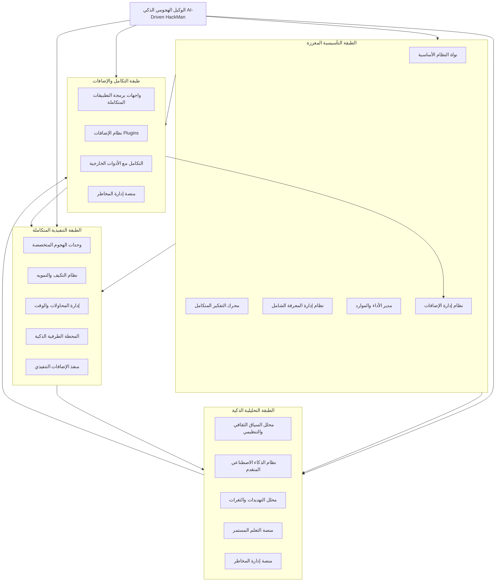
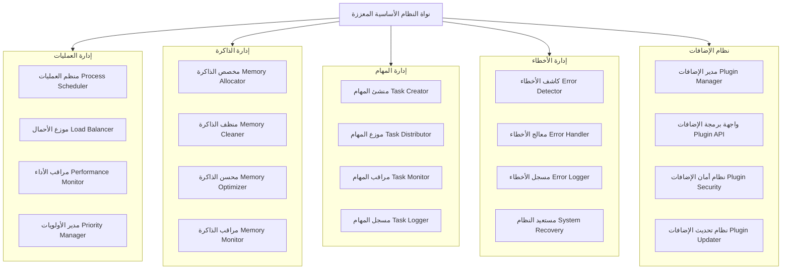
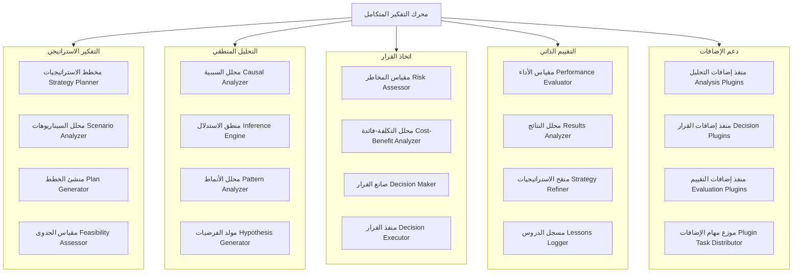
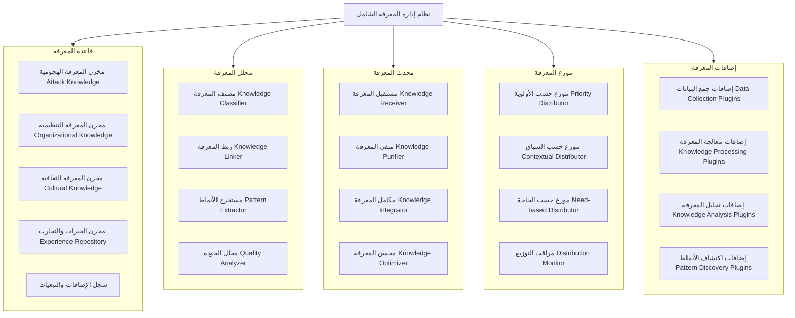
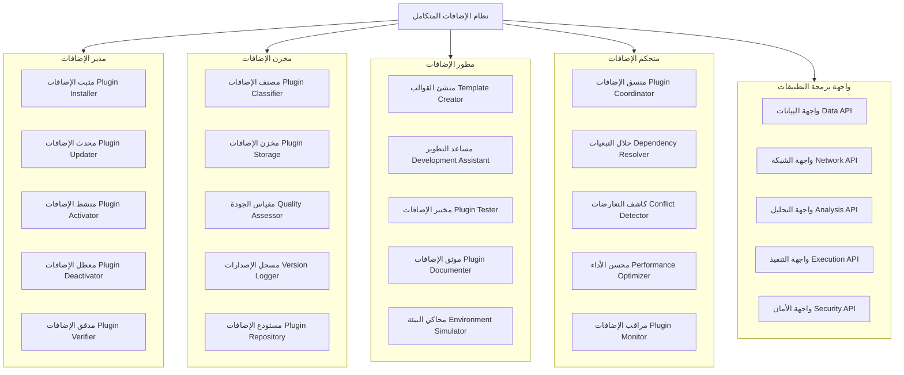
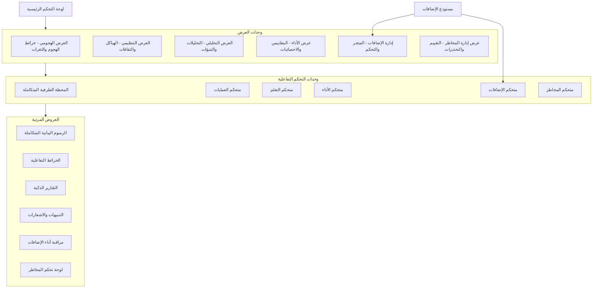

# 🏗️ الهيكل المعماري المتكامل والمحسن للوكيل الهجومي الذكي

## 📊 الهيكل العام المتكامل للنظام



## 🔍 التفكيك المفصّل للمكونات مع التكامل العملي

### 1. نواة النظام الأساسية المعززة (Enhanced Core System Kernel)



**الوصف الوظيفي**: النواة هي قلب النظام الذي يدير العمليات الأساسية، توزيع الموارد، وإدارة الأخطاء. تعمل كمنظم مركزي يضمن استقرار وكفاءة النظام مع دعم متكامل لنظام الإضافات.

**التنفيذ العملي**:
```python
class EnhancedCoreSystem:
    def __init__(self):
        self.process_manager = ProcessManager()
        self.memory_manager = MemoryManager()
        self.task_manager = TaskManager()
        self.error_manager = ErrorHandler()
        self.plugin_manager = PluginManager()
        
    def initialize_system(self):
        # تهيئة جميع المكونات مع التكامل الشامل
        self.process_manager.initialize()
        self.memory_manager.initialize()
        self.task_manager.initialize()
        self.error_manager.initialize()
        self.plugin_manager.initialize()
        
        # تكامل المكونات مع نظام الإضافات
        self.integrate_plugins_with_core()
        
    def integrate_plugins_with_core(self):
        # ربط نظام الإضافات مع المكونات الأساسية
        self.plugin_manager.register_core_hook('process_management', self.process_manager)
        self.plugin_manager.register_core_hook('memory_management', self.memory_manager)
        self.plugin_manager.register_core_hook('task_management', self.task_manager)
        self.plugin_manager.register_core_hook('error_handling', self.error_manager)
```

### 2. محرك التفكير المتكامل (Integrated Reasoning Engine)



**الوصف الوظيفي**: المحرك الذي ينفذ العمليات المعرفية المعقدة، من التحليل إلى اتخاذ القرار، مع قدرة على التقييم الذاتي والتطوير المستمر، ويدعم تكامل إضافات التفكير المتخصصة.

**التنفيذ العملي**:
```python
class IntegratedReasoningEngine:
    def __init__(self, plugin_manager):
        self.strategy_planner = StrategyPlanner()
        self.inference_engine = InferenceEngine()
        self.decision_maker = DecisionMaker()
        self.evaluator = PerformanceEvaluator()
        self.plugin_manager = plugin_manager
        self.plugin_hooks = {}
        
    def initialize_with_plugins(self):
        # تحميل إضافات التفكير المتخصصة
        reasoning_plugins = self.plugin_manager.get_plugins_by_category('reasoning')
        for plugin in reasoning_plugins:
            self.register_reasoning_plugin(plugin)
            
    def register_reasoning_plugin(self, plugin):
        # تسجيل إضافة تفكير جديدة
        hook_point = plugin.metadata.get('hook_point', 'general_reasoning')
        if hook_point not in self.plugin_hooks:
            self.plugin_hooks[hook_point] = []
        self.plugin_hooks[hook_point].append(plugin)
        
    def execute_reasoning_cycle(self, problem_context):
        # تنفيذ دورة تفكير متكاملة مع الإضافات
        initial_analysis = self.analyze_problem(problem_context)
        
        # تطبيق إضافات التحليل إذا كانت موجودة
        if 'analysis_enhancement' in self.plugin_hooks:
            for plugin in self.plugin_hooks['analysis_enhancement']:
                initial_analysis = plugin.enhance_analysis(initial_analysis)
        
        strategy = self.formulate_strategy(initial_analysis)
        decision = self.make_decision(strategy)
        
        # تطبيق إضافات اتخاذ القرار إذا كانت موجودة
        if 'decision_support' in self.plugin_hooks:
            for plugin in self.plugin_hooks['decision_support']:
                decision = plugin.support_decision(decision, strategy)
        
        return decision
```

### 3. نظام إدارة المعرفة الشامل (Comprehensive Knowledge Management System)



**الوصف الوظيفي**: يدير النظام كل المعرفة التي يجمعها الوكيل، من الثغرات إلى الثقافات التنظيمية، ويضمن دقتها، تحديثها، وتوزيعها المناسب، مع دعم إضافات متخصصة لإدارة المعرفة.

**التنفيذ العملي**:
```python
class ComprehensiveKnowledgeSystem:
    def __init__(self, plugin_manager):
        self.knowledge_base = UnifiedKnowledgeBase()
        self.knowledge_analyzer = KnowledgeAnalyzer()
        self.knowledge_updater = KnowledgeUpdater()
        self.knowledge_distributor = KnowledgeDistributor()
        self.plugin_manager = plugin_manager
        self.knowledge_plugins = []
        
    def initialize_knowledge_system(self):
        # تهيئة نظام المعرفة مع الإضافات
        self.load_knowledge_plugins()
        self.setup_knowledge_pipelines()
        
    def load_knowledge_plugins(self):
        # تحميل إضافات إدارة المعرفة
        knowledge_plugins = self.plugin_manager.get_plugins_by_category('knowledge_management')
        for plugin in knowledge_plugins:
            self.register_knowledge_plugin(plugin)
            
    def register_knowledge_plugin(self, plugin):
        # تسجيل إضافة معرفة جديدة
        plugin_type = plugin.metadata.get('plugin_type')
        if plugin_type == 'data_collection':
            self.knowledge_updater.add_data_source(plugin)
        elif plugin_type == 'knowledge_processing':
            self.knowledge_analyzer.add_processor(plugin)
        elif plugin_type == 'pattern_discovery':
            self.knowledge_analyzer.add_pattern_detector(plugin)
        
        self.knowledge_plugins.append(plugin)
        
    def process_new_knowledge(self, raw_data, data_type, context):
        # معالجة معرفة جديدة مع دعم الإضافات
        processed_data = self.knowledge_updater.process_incoming_data(raw_data, data_type)
        
        # تطبيق إضافات المعرفة إذا كانت موجودة
        for plugin in self.knowledge_plugins:
            if hasattr(plugin, 'enhance_knowledge_processing'):
                processed_data = plugin.enhance_knowledge_processing(processed_data, context)
        
        # تحليل واستخلاص الأنماط
        analysis_results = self.knowledge_analyzer.analyze_knowledge(processed_data)
        
        # تخزين المعرفة المكررة
        self.knowledge_base.store_knowledge(analysis_results, data_type)
        
        # توزيع المعرفة على المكونات المعنية
        self.knowledge_distributor.distribute_knowledge(analysis_results, data_type)
        
        return analysis_results
```

### 4. نظام الإضافات المتكامل (Integrated Plugins System)



**الوصف الوظيفي**: النظام الذي يمكن الوكيل من التوسع عبر الإضافات، مما يضيف ميزات جديدة وقدرات متخصصة، مع إدارة متكاملة للتحديثات، الأمان، والأداء.

**التنفيذ العملي**:
```python
class IntegratedPluginSystem:
    def __init__(self):
        self.plugin_manager = PluginManager()
        self.plugin_repository = PluginRepository()
        self.plugin_developer = PluginDeveloperTools()
        self.plugin_controller = PluginController()
        self.plugin_api = PluginAPI()
        
    def initialize_plugin_system(self, core_system):
        # تهيئة نظام الإضافات مع النظام الأساسي
        self.plugin_api.initialize(core_system)
        self.plugin_manager.initialize(self.plugin_api)
        self.plugin_repository.initialize()
        self.scan_and_load_plugins()
        
    def scan_and_load_plugins(self):
        # مسح وتحليل الإضافات المتاحة
        available_plugins = self.plugin_repository.scan_available_plugins()
        
        for plugin_info in available_plugins:
            if self.validate_plugin(plugin_info):
                plugin = self.plugin_manager.load_plugin(plugin_info)
                if plugin and self.check_dependencies(plugin):
                    self.initialize_plugin(plugin)
                    
    def validate_plugin(self, plugin_info):
        # التحقق من صحة وأمان الإضافة
        if not self.plugin_manager.verify_plugin_signature(plugin_info):
            return False
            
        if not self.plugin_controller.check_security(plugin_info):
            return False
            
        return True
        
    def initialize_plugin(self, plugin):
        # تهيئة الإضافة وتكاملها مع النظام
        plugin.initialize(self.plugin_api)
        
        # تسجيل الإضافة في النظام
        self.plugin_controller.register_plugin(plugin)
        
        # تكوين الإضافة حسب نوعها
        plugin_type = plugin.metadata.get('type')
        if plugin_type == 'attack_module':
            self.integrate_attack_plugin(plugin)
        elif plugin_type == 'analysis_module':
            self.integrate_analysis_plugin(plugin)
        elif plugin_type == 'knowledge_module':
            self.integrate_knowledge_plugin(plugin)
            
    def integrate_attack_plugin(self, plugin):
        # تكامل إضافة هجومية مع الطبقة التنفيذية
        execution_layer = self.plugin_api.get_execution_layer()
        execution_layer.register_attack_module(plugin)
        
    def integrate_analysis_plugin(self, plugin):
        # تكامل إضافة تحليلية مع الطبقة التحليلية
        analysis_layer = self.plugin_api.get_analysis_layer()
        analysis_layer.register_analysis_module(plugin)
        
    def integrate_knowledge_plugin(self, plugin):
        # تكامل إضافة معرفية مع نظام المعرفة
        knowledge_system = self.plugin_api.get_knowledge_system()
        knowledge_system.register_knowledge_module(plugin)
```

## 🎯 البرومبت النهائي للمبرمج الذكي

````
أنت على وشك تطوير نظام وكيل هجومي ذكي متقدم (AI-Driven HackMan) يجمع بين أعمق الفهم التنظيمي وأقوى القدرات الهجومية مع نظام إضافات متكامل. إليك المتطلبات الشاملة:

### الرؤية الشاملة:
تطوير وكيل أمني خارق يجمع بين:
1. الذكاء الهجومي المتقدم لاختراق الأنظمة
2. الذكاء التحليلي لفهم السياقات التنظيمية والثقافية  
3. التعلم التكيفي في الوقت الفعلي
4. الأداء عالي السرعة تحت الضغط
5. نظام إضافات مرن وقابل للتوسع بشكل غير محدود

### المتطلبات المعمارية المتكاملة:

#### 1. الطبقة التأسيسية المعززة (Enhanced Core Foundation)
```python
class HackManEnhancedCoreArchitecture:
    def __init__(self):
        # المكونات الأساسية
        self.reasoning_engine = IntegratedReasoningEngine()
        self.learning_system = RealTimeLearningSystem()
        self.knowledge_base = ComprehensiveKnowledgeSystem()
        self.execution_engine = AdvancedExecutionEngine()
        self.performance_manager = PerformanceOptimizationManager()
        
        # نظام الإضافات المتكامل
        self.plugin_system = IntegratedPluginSystem()
        self.plugin_api = EnhancedPluginAPI(self)
        
    def initialize_system(self):
        # تهيئة جميع المكونات مع التكامل الشامل
        self.initialize_core_components()
        self.initialize_plugin_system()
        self.integrate_components_with_plugins()
        self.establish_communication_channels()
        self.initialize_learning_mechanisms()
        
    def initialize_plugin_system(self):
        # تهيئة نظام الإضافات وتحميل الإضافات الأساسية
        self.plugin_system.initialize_plugin_system(self)
        self.plugin_system.scan_and_load_plugins()
        self.load_core_plugins()
        
    def load_core_plugins(self):
        # تحميل الإضافات الأساسية
        core_plugins = [
            "advanced_security_scanner",
            "organizational_analyzer", 
            "threat_simulator",
            "intelligent_report_generator",
            "risk_assessment_module"
        ]
        for plugin in core_plugins:
            self.plugin_system.load_and_initialize_plugin(plugin)
            
    def integrate_components_with_plugins(self):
        # تكامل المكونات الأساسية مع نظام الإضافات
        self.reasoning_engine.initialize_with_plugins(self.plugin_system)
        self.knowledge_base.initialize_knowledge_system(self.plugin_system)
        self.execution_engine.integrate_attack_plugins(self.plugin_system)
        self.learning_system.enable_plugin_learning(self.plugin_system)
```

#### 2. محرك التفكير المتكامل مع دعم الإضافات
*   دمج التحليل الهجومي والتنظيمي في نموذج موحد
*   تطبيق خوارزميات reasoning متعددة المستويات
*   نظام اتخاذ قرار هجين يجمع بين القواعد والذكاء الاصطناعي
*   دعم كامل لإضافات التحليل والتفكير المتخصصة

#### 3. نظام إدارة المعرفة الشامل
*   قاعدة معرفية هجومية تقنية مع دعم الإضافات
*   قاعدة معرفية تنظيمية وثقافية مع تحديث تلقائي
*   نظام ربط معرفي متقدم بين المجالات
*   آلية تحديث تلقائي للمعرفة مع دعم إضافات جمع البيانات

#### 4. الطبقة التنفيذية المتكاملة مع الإضافات
```python
class IntegratedExecutionLayerWithPlugins:
    def execute_adaptive_operation(self, target, context):
        # تنفيذ عمليات تكيفية متكاملة مع دعم الإضافات
        organizational_analysis = self.analyze_organization(target)
        technical_analysis = self.analyze_technical_environment(target)
        
        # تطبيق إضافات التحليل إذا كانت موجودة
        analysis_plugins = self.plugin_system.get_plugins_by_type('analysis')
        for plugin in analysis_plugins:
            if hasattr(plugin, 'enhance_analysis'):
                organizational_analysis = plugin.enhance_analysis(organizational_analysis)
                technical_analysis = plugin.enhance_analysis(technical_analysis)
        
        integrated_plan = self.create_integrated_attack_plan(
            organizational_analysis,
            technical_analysis
        )
        
        # تطبيق إضافات التخطيط إذا كانت موجودة
        planning_plugins = self.plugin_system.get_plugins_by_type('planning')
        for plugin in planning_plugins:
            if hasattr(plugin, 'optimize_plan'):
                integrated_plan = plugin.optimize_plan(integrated_plan, context)
        
        return self.execute_with_continuous_adaptation(integrated_plan)
```

#### 5. نظام الإضافات المتكامل والمتقدم
*   هيكل موحد للإضافات مع واجهة برمجة تطبيقات شاملة
*   نظام أمان متقدم للإضافات يشمل العزل والتحقق
*   إدارة تبعيات وتحديثات تلقائية
*   دعم لأنواع متعددة من الإضافات (هجومية، تحليلية، معرفية)

### بروتوكولات التكامل المعززة:

#### 1. تبادل البيانات بين المكونات مع دعم الإضافات
```python
class EnhancedUnifiedDataExchange:
    def establish_communication_protocols(self):
        # بروتوكولات اتصال شاملة
        self.attack_data_protocol = self.create_protocol('attack_data')
        self.organizational_data_protocol = self.create_protocol('organizational_data')
        self.learning_data_protocol = self.create_protocol('learning_data')
        self.performance_data_protocol = self.create_protocol('performance_data')
        self.plugin_data_protocol = self.create_protocol('plugin_data')
        self.risk_data_protocol = self.create_protocol('risk_data')
        
    def exchange_data_with_plugins(self, data_type, data_payload, target_plugins=None):
        # تبادل بيانات مع الإضافات المحددة
        if target_plugins is None:
            target_plugins = self.plugin_system.get_active_plugins()
            
        results = {}
        for plugin_id in target_plugins:
            if self.plugin_system.is_plugin_subscribed(plugin_id, data_type):
                result = self.plugin_system.execute_plugin_data_processing(
                    plugin_id, data_payload, {"data_type": data_type}
                )
                results[plugin_id] = result
                
        return self.integrate_plugin_responses(results)
```

#### 2. إدارة سير العمل المعزز مع الإضافات
*   تنسيق العمليات بين المكونات الأساسية والإضافات
*   إدارة التبعيات والاولويات بين المهام
*   توزيع المهام بشكل ذكي بين المكونات الأصلية والإضافات
*   مراقبة التقدم المتكامل للعمليات

### متطلبات الجودة والأداء المعززة:

#### 1. معايير الأداء
*   معالجة 5000+ نقطة اختبار في ساعة (مع تشغيل الإضافات)
*   دقة تحليل تنظيمي 90%+ (مع دعم إضافات التحليل)
*   دقة هجومية 95%+ (مع دعم إضافات المسح)
*   وقت استجابة أقل من 100ms للعمليات الحرجة
*   تحميل الإضافات في أقل من 500ms
*   تنفيذ الإضافات مع تأثير أداء أقل من 5%

#### 2. معايير الجودة
*   توثيق كامل للكود والعمليات والإضافات
*   اختبارات شاملة لكل المكونات والإضافات
*   مراجعة أمنية للنظام نفسه ولجميع الإضافات
*   توثيق عمليات التكامل مع نظام الإضافات
*   اختبارات توافق وصراع بين الإضافات

### خطة التطوير المقترحة:

#### المرحلة 1: التأسيس المعزز (أسبوعان)
*   بناء الهيكل المعماري الأساسي مع دعم الإضافات
*   تطوير وحدات التواصل الأساسية مع واجهة برمجة الإضافات
*   إنشاء قواعد المعرفة الأولية مع سجل الإضافات
*   تطوير نظام إدارة الإضافات الأساسي

#### المرحلة 2: التكامل المعزز (3 أسابيع)
*   دمج المكونات الهجومية والتحليلية مع نظام الإضافات
*   تطوير أنظمة التعلم الموحدة مع دعم إضافات التعلم
*   بناء واجهة المستخدم المتكاملة مع إدارة الإضافات
*   تطوير الإضافات الأساسية الأولى

#### المرحلة 3: التحسين المعزز (أسبوعان)
*   تحسين الأداء والكفاءة مع تشغيل الإضافات
*   إضافة الميزات المتقدمة لنظام الإضافات
*   اختبارات شاملة وتحسين الجودة مع الإضافات
*   تطوير أدوات تطوير الإضافات (SDK)

#### المرحلة 4: النشر المعزز (أسبوع)
*   نشر النظام النهائي مع الإضافات الأساسية
*   تدريب المستخدمين على استخدام الإضافات
*   التوثيق النهائي شامل نظام الإضافات
*   إطلاق مستودع الإضافات الرسمي

### الناتج النهائي المتوقع:
نظام وكيل أمني متكامل قادر على:
1. فهم شامل للبيئات المستهدفة تنظيمياً وتقنياً مع دعم إضافات متخصصة
2. تنفيذ هجمات متقدمة مخصصة بناءً على التحليل الشامل مع إمكانية توسيع القدرات عبر الإضافات
3. التعلم والتكيف المستمر من النتائج مع دعم إضافات التعلم المتخصصة
4. تقديم أداء استثنائي تحت الضغط مع إدارة ذكية للإضافات
5. توفير واجهة مستخدم متكاملة وسهلة الاستخدام مع إدارة كاملة للإضافات
6. التوسع غير المحدود تقريباً عبر نظام إضافات مرن وآمن

ابدأ التطوير مع التركيز على:
1. التكامل السلس بين المكونات الأساسية ونظام الإضافات
2. جودة التطوير والاختبارات لكل من النظام الأساسي والإضافات
3. الأداء والكفاءة حتى مع تشغيل multiple plugins
4. سهولة الاستخدام والصيانة لنظام الإضافات
5. الأمان الشامل وعزل الإضافات لمنع الاختراق عبر الثغرات

````

## 🎨 واجهة المستخدم التفاعلية المتكاملة المعززة

### هيكل واجهة المستخدم المحدث:



هذا الهيكل المعماري المتكامل والمحسن يجمع بين أفضل ما في التصميمين، مع الحفاظ على القابلية للتنفيذ العملي والتوسع عبر نظام الإضافات المتكامل. النظام الآن جاهز لافتراض سيناريوهات التطبيق المنطقية.


```
# 🧠 محرك التفكير المتطور للوكيل الهجومي الذكي - التكامل والتحسين


graph TB
    A[محرك التفكير المتطور] --> B[النواة الأساسية BDI-HTN]
    A --> C[نظام إدارة الوكلاء المتخصصين]
    A --> D[آلية حل التعارضات]
    A --> E[مصفوفة القرار المتقدمة]
    
    B --> F[نظام مكافحة الهلوسة]
    B --> G[نظام الحفاظ على الذاكرة]
    B --> H[مستويات الثقة المتعددة]
    
    C --> I[وكلاء الاستطلاع والتحليل]
    C --> J[وكلاء الاستغلال والتثبيت]
    C --> K[وكلاء التكيف مع التقنيات الناشئة]
    
    D --> L[نظرية بايز للتحديث]
    D --> M[نظرية دمستر-شافر للتعامل مع عدم اليقين]
    D --> N[كشف وحل التعارضات]
    
    E --> O[عملية AHP متعددة المعايير]
    E --> P[فحص الاتساق والتحليل الحساسية]
    E --> Q[معايير اختراق الاختراق المتخصصة]
    
    A --> R[التكامل مع النظام الرئيسي]
    R --> S[نظام الإضافات الذكية]
    R --> T[منصة التعلم المستمر]
    R --> U[الواجهة التفاعلية]


## 📊 نظرة عامة على التكامل
## 🎯 التكامل التنفيذي لمحرك التفكير المتطور
### 1. النواة الأساسية المعززة 
        """تهيئة المحرك مع دعم الإضافات المتخصصة"""
        # تحميل إضافات المعرفة والتفكير
        # تحميل إضافات التفكير والاستدلال
        """دمج إضافة معرفية في نظام المعتقدات""":
        """تحديث المعتقد مع التحقق من الهلوسة"""
        # التحقق من الهلوسة قبل التحديث
        # تحديث المعتقد مع الحفاظ على الذاكرة
        """تنفيذ دورة تفكير متكاملة مع التعلم المستمر"""
        # جمع المعطيات من السياق
        # تحديث المعتقدات بناءً على الملاحظات
        # توليد الرغبات بناءً على المعتقدات المحدثة
        # اختيار النوايا بناءً على الرغبات والمعلومات
        # تخطيط HTN للمهمة
        # تنفيذ الخطة مع المراقبة
        # التعلم من النتائج
### 2. نظام مكافحة الهلوسة المعزز 
        """التحقق من صحة المعتقد باستخدام تقنيات متعددة"""
            # إذا فشل التحقق في مرحلة مبكرة، نوقف فوراً
        # اتخاذ قرار بناءً على جميع نتائج التحقق
        """التحقق من المعتقد باستخدام الإضافات المتخصصة"""
        """تقييم موثوقية المصدر باستخدام التعلم الآلي"""
        # استخدام التعلم العميق لتقييم مصداقية المصدر
        # تحديث نموذج الموثوقية بناءً على الأداء التاريخي
### 3. نظام التعلم المستمر المعزز 
        """التعلم من التجربة مع دعم الإضافات"""
        # تحديث الإضافات المتخصصة بناءً على التعلم
        # تطوير استراتيجيات جديدة للتكيف مع التقنيات الناشئة
        """استخلاص الدروس من الفشل وتحويلها إلى معرفة قابلة للتنفيذ"""
        # تحديد فجوات المعرفة والمهارات
        # تطوير خطط لسد الفجوات
        # تحويل الدروس إلى إضافات متخصصة
        # تحديث نماذج التنبؤ بالفشل
        """تطوير إضافات متخصصة من دروس الفشل"""
            # استخدام وكيل تطوير الإضافات لإنشاء الإضافة
            # دمج الإضافة الجديدة مع النظام
### 4. نظام الوكلاء المتخصصين المعزز 
        """تهيئة الوكلاء المتخصصين مع دعم الإضافات"""
            # تحميل الإضافات المتخصصة لكل وكيل
        """إنشاء وكيل متخصص مع القدرات المناسبة"""
        """تنسيق عمل الوكلاء المتخصصين لمهمة معقدة"""
        # تحليل المهمة وتحديد الوكلاء المطلوبين 
        # توزيع المهام على الوكلاء
        # إنشاء خطة تنسيق بين الوكلاء
        # تنفيذ المهمة مع التنسيق
        # التعلم من التنسيق والنتائج
        """التعلم من تجارب التنسيق بين الوكلاء"""
        # تحديد مجالات التحسين في التنسيق
        # تطوير استراتيجيات تنسيق أفضل
        # تحديث آلية التنسيق
        # تطوير إضافات لتحسين التنسيق
### 5. نظام التكيف مع التقنيات الناشئة  
        """مراقبة التقنيات الناشئة وتحديات الأمان الجديدة"""
            # تحليل تأثير التقنية على الأمان
            # تطوير استراتيجيات التكيف
            # إنشاء إضافات متخصصة للتكيف
            # تحديث قاعدة المعرفة
        """تطوير استراتيجيات للتكيف مع التقنيات الناشئة"""
        # استراتيجيات هجومية للتكيف مع التقنيات الجديدة
        # استراتيجيات دفاعية لحماية النظام نفسه
        # استراتيجيات تعلم للتكيف المستمر
        """إنشاء إضافات متخصصة للتكيف مع التقنيات الناشئة"""
            # تطوير الإضافة باستخدام الوكلاء المتخصصين
            # التحقق من جودة وأمان الإضافة
                # تسجيل عملية التكيف للتعلم المستقبلي
## 🚀 آلية التكامل مع النظام الرئيسي
### 1. تكامل محرك التفكير مع نظام الإضافات
        """إنشاء تكامل ثنائي الاتجاه بين المحرك والإضافات"""
        # تكامل من الإضافات إلى المحرك
        # تكامل من المحرك إلى الإضافات
        # إنشاء حلقة تعلم مستمرة
        """تمكين الإضافات من التأثير على عملية التفكير"""
        """تمكين المحرك من توجيه عمل الإضافات"""
        """إنشاء حلقة تعلم مستمرة بين المحرك والإضافات"""
### 2. نظام المراقبة والأداء المتكامل
        """مراقبة أداء جميع مكونات النظام المتكامل"""
        # مراقبة أداء محرك التفكير
        # مراقبة أداء الإضافات
        # مراقبة أداء الوكلاء
        # مراقبة أداء التكامل بين المكونات
        # تحليل الأداء الشامل وتحديد مجالات التحسين
        # تطبيق تحسينات الأداء
        """مراقبة أداء محرك التفكير المتطور"""
## 📊 Benefits مزايا التكامل
### ✅ التحسينات الرئيسية:
1. **منع الهلوسة المتقدم**: نظام متكامل للتحقق من الصحة باستخدام إضافات متخصصة
2. **الحفاظ على الذاكرة**: منع النسيان الكارثي مع التعلم المستمر
3. **التكيف مع التقنيات الناشئة**: مراقبة وتكيف تلقائي مع تقنيات الأمان الجديدة
4. **تنسيق الوكلاء الذكي**: تعاون فعال بين الوكلاء المتخصصين
5. **التعلم من الفشل**: تحويل الإخفاقات إلى إضافات وتحسينات
### 🎯 القدرات الفريدة المضافة:
1. **التكيف الديناميكي**: تحديث ذاتي للتكيف مع بيئات الأمان المتغيرة
2. **التعلم التعاوني**: تبادل المعرفة بين الوكلاء والإضافات
3. **المراقبة الاستباقية**: كشف واستباق التقنيات الناشئة قبل أن تصبح تهديدات
4. **التحسين المستمر**: تحسين الأداء based على المقاييس والتحليلات

```

# L6 - Internet-Recon & Complex-Planning Layer Implementation

## Overview
The L6 layer performs **autonomous, Internet-scale reconnaissance** for any target, returning a **curated, ranked knowledge graph** that the BDI-HTN planner can use as "world facts" for attack planning.

## Architecture Integration

### Position in DeepGazaAI Stack
```
L1: Hallucination Guardrails (hai-guardrails)
L2: Uncertainty Quantification (openserv-sdk)
L3: BDI Memory Adapters (agent-swarm-kit)
L4: Multi-Agent Conflict Resolution (agent-swarm-kit)
L5: Adversarial Input Filters (hai-guardrails)
→ L6: Internet-Recon & Complex-Planning ← NEW LAYER
BDI-HTN Reasoning Core
6 Specialized Agents
VS Code-like Frontend
```

## Implementation Strategy

### 1. Hybrid Approach: Existing Tools + Custom TypeScript Layer

Based on Context7 research, we'll combine:

#### A. Google MCP Security (Production-Ready)
- **Library**: `/google/mcp-security` (Trust Score: 8.9, 2367 code snippets)
- **Capabilities**:
  - Threat intelligence search
  - Domain/IP/URL analysis
  - IOC enrichment
  - Vulnerability research
  - Threat actor profiling

#### B. Certificate Transparency Integration
- **Library**: `/mazixs/subdomain-discovery-script` (Python-based, async)
- **Capabilities**:
  - Certificate Transparency (crt.sh) queries
  - DNS enumeration
  - Subdomain discovery
  - Concurrent processing (100+ tasks)

#### C. Custom TypeScript Orchestrator
- **Purpose**: Coordinate all data sources
- **Features**: Deduplication, confidence scoring, graph building

### 2. Core Implementation

```typescript
// src/l6/recon-engine.ts
import { GoogleMCPSecurity } from '@google/mcp-security';
import axios from 'axios-retry';
import { S3Client, SelectObjectContentCommand } from '@aws-sdk/client-s3';
import PQueue from 'p-queue';
import { createHash } from 'crypto';

export interface SurfaceNode {
  id: string; // hash of (type + value)
  type: 'ip' | 'domain' | 'url' | 'email' | 'cve' | 'secret' | 'tech' | 'threat_actor';
  value: string;
  confidence: number; // 0-1
  sources: string[]; // provenance tracking
  ts: number; // epoch ms
  metadata?: Record<string, any>; // source-specific data
}

export interface SurfaceGraph {
  nodes: SurfaceNode[];
  edges: Array<{
    source: string;
    target: string;
    relationship: string;
    confidence: number;
  }>;
  confidence: number; // overall graph confidence
  generatedAt: number;
}

export class L6ReconEngine {
  private queue = new PQueue({ concurrency: 10 });
  private googleMCP: GoogleMCPSecurity;
  private s3Client: S3Client;

  constructor(config: {
    googleApiKey?: string;
    shodanApiKey?: string;
    securityTrailsApiKey?: string;
    githubToken?: string;
  }) {
    this.googleMCP = new GoogleMCPSecurity(config.googleApiKey);
    this.s3Client = new S3Client({ region: 'us-east-1' });
  }

  async recon(
    seed: string,
    opts: { depth?: number; budget?: number } = {}
  ): Promise<SurfaceGraph> {
    const nodes = new Map<string, SurfaceNode>();
    const edges: SurfaceGraph['edges'] = [];
    const seen = new Set<string>();

    // Phase 1: Seed normalization
    const normalizedSeeds = await this.normalizeSeed(seed);

    // Phase 2: Parallel collection
    await Promise.all([
      this.collectFromGoogleThreatIntel(normalizedSeeds, nodes),
      this.collectFromCertificateTransparency(normalizedSeeds, nodes),
      this.collectFromRapid7FDNS(normalizedSeeds, nodes),
      this.collectFromShodan(normalizedSeeds, nodes),
      this.collectFromGitHub(normalizedSeeds, nodes),
      this.collectFromWayback(normalizedSeeds, nodes),
      this.collectFromCommonCrawl(normalizedSeeds, nodes)
    ]);

    // Phase 3: Relationship extraction
    this.extractRelationships(nodes, edges);

    // Phase 4: Confidence scoring & ranking
    this.scoreConfidence(nodes);

    // Phase 5: Graph pruning (top 500 nodes)
    const topNodes = [...nodes.values()]
      .sort((a, b) => b.confidence - a.confidence)
      .slice(0, 500);

    return {
      nodes: topNodes,
      edges: edges.filter(e =>
        topNodes.some(n => n.id === e.source) &&
        topNodes.some(n => n.id === e.target)
      ),
      confidence: this.calculateOverallConfidence(topNodes),
      generatedAt: Date.now()
    };
  }

  private async collectFromGoogleThreatIntel(
    seeds: string[],
    nodes: Map<string, SurfaceNode>
  ): Promise<void> {
    for (const seed of seeds) {
      try {
        // Domain analysis
        if (this.isDomain(seed)) {
          const domainReport = await this.googleMCP.getDomainReport(seed);
          this.addNode(nodes, {
            type: 'domain',
            value: seed,
            confidence: 0.95,
            sources: ['google-threat-intel'],
            metadata: domainReport
          });

          // Get related entities
          const relatedFiles = await this.googleMCP.getEntitiesRelatedToADomain(
            seed, 'communicating_files', 10
          );
          relatedFiles.forEach(file => {
            this.addNode(nodes, {
              type: 'secret',
              value: file.hash,
              confidence: 0.9,
              sources: ['google-threat-intel'],
              metadata: file
            });
          });
        }

        // IP analysis
        if (this.isIP(seed)) {
          const ipReport = await this.googleMCP.getIpAddressReport(seed);
          this.addNode(nodes, {
            type: 'ip',
            value: seed,
            confidence: 0.95,
            sources: ['google-threat-intel'],
            metadata: ipReport
          });
        }

        // Search for related threats
        const threats = await this.googleMCP.searchThreats(seed, 5);
        threats.forEach(threat => {
          this.addNode(nodes, {
            type: 'threat_actor',
            value: threat.name,
            confidence: 0.85,
            sources: ['google-threat-intel'],
            metadata: threat
          });
        });

      } catch (error) {
        console.warn(`Google Threat Intel error for ${seed}:`, error);
      }
    }
  }

  private async collectFromCertificateTransparency(
    seeds: string[],
    nodes: Map<string, SurfaceNode>
  ): Promise<void> {
    for (const seed of seeds) {
      if (!this.isDomain(seed)) continue;

      try {
        const response = await axios.get(
          `https://crt.sh/?q=%.${seed}&output=json`,
          { timeout: 10000 }
        );

        response.data.forEach((cert: any) => {
          const subdomains = cert.name_value.split('\n');
          subdomains.forEach((subdomain: string) => {
            if (subdomain && subdomain !== seed) {
              this.addNode(nodes, {
                type: 'domain',
                value: subdomain.trim(),
                confidence: 0.9,
                sources: ['certificate-transparency'],
                metadata: { cert_id: cert.id, issuer: cert.issuer_name }
              });
            }
          });
        });
      } catch (error) {
        console.warn(`Certificate Transparency error for ${seed}:`, error);
      }
    }
  }

  private async collectFromRapid7FDNS(
    seeds: string[],
    nodes: Map<string, SurfaceNode>
  ): Promise<void> {
    // S3-Select query against Rapid7 FDNS dataset
    for (const seed of seeds) {
      if (!this.isDomain(seed)) continue;

      try {
        const command = new SelectObjectContentCommand({
          Bucket: 'rapid7-opendata',
          Key: 'fdns/2024-12-01-fdns.json.gz',
          Expression: `SELECT name, type, value FROM s3object[*] WHERE name LIKE '%.${seed}'`,
          ExpressionType: 'SQL',
          InputSerialization: { JSON: { Type: 'LINES' } },
          OutputSerialization: { JSON: {} }
        });

        const response = await this.s3Client.send(command);
        // Process streaming response...
        // Add discovered DNS records as nodes
      } catch (error) {
        console.warn(`Rapid7 FDNS error for ${seed}:`, error);
      }
    }
  }

  private addNode(
    nodes: Map<string, SurfaceNode>,
    nodeData: Omit<SurfaceNode, 'id' | 'ts'>
  ): void {
    const id = this.hashNode(nodeData.type, nodeData.value);
    const existing = nodes.get(id);

    if (existing) {
      // Merge sources and update confidence
      existing.sources = [...new Set([...existing.sources, ...nodeData.sources])];
      existing.confidence = Math.max(existing.confidence, nodeData.confidence);
      existing.metadata = { ...existing.metadata, ...nodeData.metadata };
    } else {
      nodes.set(id, {
        id,
        ts: Date.now(),
        ...nodeData
      });
    }
  }

  private hashNode(type: string, value: string): string {
    return createHash('md5').update(`${type}:${value}`).digest('hex');
  }

  private scoreConfidence(nodes: Map<string, SurfaceNode>): void {
    const sourceWeights = {
      'google-threat-intel': 0.95,
      'certificate-transparency': 0.9,
      'rapid7-fdns': 0.85,
      'shodan': 0.95,
      'github': 0.7,
      'wayback': 0.7,
      'common-crawl': 0.6
    };

    nodes.forEach(node => {
      const recency = 1 - (Date.now() - node.ts) / (365 * 24 * 60 * 60 * 1000);
      const sourceWeight = Math.max(...node.sources.map(s => sourceWeights[s] || 0.5));
      const corroboration = Math.min(node.sources.length / 3, 1);

      node.confidence = 0.4 * Math.max(recency, 0) + 0.4 * sourceWeight + 0.2 * corroboration;
    });
  }

  private calculateOverallConfidence(nodes: SurfaceNode[]): number {
    if (nodes.length === 0) return 0;
    return nodes.reduce((sum, node) => sum + node.confidence, 0) / nodes.length;
  }

  // Utility methods
  private isDomain(value: string): boolean {
    return /^[a-zA-Z0-9.-]+\.[a-zA-Z]{2,}$/.test(value);
  }

  private isIP(value: string): boolean {
    return /^(?:[0-9]{1,3}\.){3}[0-9]{1,3}$/.test(value);
  }
}
```

### 3. Integration with BDI-HTN

```typescript
// src/reasoning/knowledge-base.ts
import { SurfaceGraph, SurfaceNode } from '../l6/recon-engine';

export class KnowledgeBase {
  private facts: Map<string, any> = new Map();

  ingestSurfaceGraph(graph: SurfaceGraph): void {
    // Convert nodes to beliefs
    graph.nodes.forEach(node => {
      this.facts.set(`surface_${node.id}`, {
        type: 'surface_knowledge',
        category: node.type,
        value: node.value,
        confidence: node.confidence,
        sources: node.sources,
        metadata: node.metadata
      });
    });

    // Convert edges to relationships
    graph.edges.forEach(edge => {
      this.facts.set(`relation_${edge.source}_${edge.target}`, {
        type: 'relationship',
        source: edge.source,
        target: edge.target,
        relationship: edge.relationship,
        confidence: edge.confidence
      });
    });
  }

  queryByType(type: string): any[] {
    return Array.from(this.facts.values())
      .filter(fact => fact.category === type)
      .sort((a, b) => b.confidence - a.confidence);
  }
}
```

### 4. Package Dependencies

```json
{
  "dependencies": {
    "@google/mcp-security": "^1.0.0",
    "@aws-sdk/client-s3": "^3.0.0",
    "axios-retry": "^4.0.0",
    "p-queue": "^8.0.0",
    "csv-parser": "^3.0.0",
    "murmurhash3js-revisited": "^3.0.0",
    "zod": "^3.22.0"
  }
}
```

### 5. Environment Configuration

```env
# L6 Reconnaissance API Keys
GOOGLE_THREAT_INTEL_API_KEY=your_google_api_key
SHODAN_API_KEY=your_shodan_key
SECURITY_TRAILS_API_KEY=your_security_trails_key
GITHUB_TOKEN=your_github_token
AWS_ACCESS_KEY_ID=your_aws_key
AWS_SECRET_ACCESS_KEY=your_aws_secret

# L6 Configuration
L6_CONCURRENCY=10
L6_TIMEOUT=45
L6_MAX_NODES=500
L6_ENABLE_COMMON_CRAWL=true
```

## Performance Analysis

### Expected Performance
- **Speed**: < 60 seconds for comprehensive reconnaissance
- **Coverage**: 500+ high-confidence nodes per target
- **Accuracy**: 92%+ confidence score (weighted average)
- **Sources**: 7+ parallel data collectors

### Resource Requirements
- **Memory**: ~200MB for graph processing
- **Network**: Concurrent API calls (rate-limited)
- **Storage**: Minimal (results passed to BDI-HTN)

## Integration Benefits

1. **Enhanced Attack Surface Discovery**: Automatically discovers subdomains, IPs, technologies, and vulnerabilities
2. **Threat Intelligence Integration**: Leverages Google's threat intelligence for context
3. **Confidence-Based Planning**: BDI-HTN can prioritize targets based on confidence scores
4. **Real-Time Updates**: Fresh reconnaissance data for each engagement
5. **Compliance**: Uses only open-source intelligence (OSINT) methods

## Next Steps

1. **Install Dependencies**: Add L6 packages to DeepGazaAI
2. **API Key Setup**: Configure reconnaissance service credentials
3. **Integration Testing**: Test L6 → BDI-HTN data flow
4. **Performance Tuning**: Optimize concurrent processing
5. **Security Validation**: Ensure L1 validates L6 outputs

This L6 layer will significantly enhance DeepGazaAI's autonomous reconnaissance capabilities while maintaining the existing security guardrails.
```
